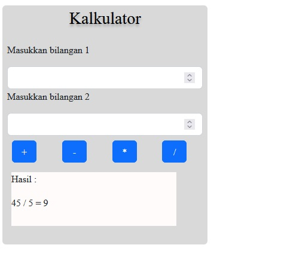

# vsga_kalkulator
[](https://travis-ci.org/matthiasnoback/badges)
[](https://github.com/Naereen/StrapDown.js)

[](https://github.com/Naereen/badges/)

Implementasi Rancangan User Interface (UI) Kalkulator Sederhana menggunakan figma ke dalam kode program HTML, dan CSS. Serta menerapkan pemrograman terstruktur kedalam bahasa pemrograman PHP. Kalkulator Sederhana ini dibuat untuk memudahkan dalam melakukan operasi aritmatika seperti (pertambahan, pengurangan, perkalian, dan pembagian) untuk memenuhi penugasan VSGA Kominfo.

# Requirement
* Text Editor (Notepad++, Sublime Text, Visual Studio Code, dll)
* Web Server (XAMPP, MAMPP, dll)
* Web Browser (Chrome, Mozilla Firefox, Microsoft Edge, Safari, dll)

# Instalasi
1. Install salah satu dari code/text editor di bawah ini :
   * Notepad++ (https://notepad-plus-plus.org/downloads/)
   * Sublime Text (https://www.sublimetext.com/3)
   * Visual Studi Code (https://code.visualstudio.com/download)
2. Install web server [XAMPP](https://www.apachefriends.org/download.html)
3. Install web browser sebagai tempat berjalannya program website. Install salah satu dari web browser di bawah ini :
   * Chrome (https://www.google.com/intl/id_id/chrome/)
   * Mozilla (https://www.mozilla.org/id/firefox/new/)
   * Microsoft Edge (https://www.microsoft.com/id-id/edge)
4. Jika ingin menjadikan repo vsga_kalkulator sebagai Remote atau menambahkan Kalkulator Sederhana di komputer, anda dapat melakukan clone repository dan simpan pada folder htdocs 
   ```git 
   git clone https://github.com/iftahfahmiwaladi/vsga_kalkulator
   ```

# Penggunaan/Usage
1.) Fungsi Penjumlahan


2.) Fungsi Pengurangan


3.) Fungsi Perkalian


4.) Fungsi Pembagian



# Credits
> Iftah Fahmi Waladi
